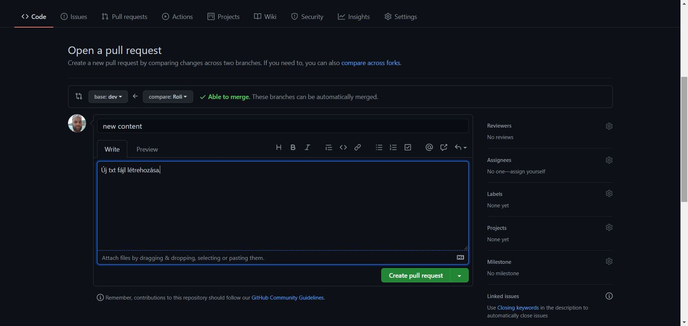

# str-csapat-teszt
Kizárólag a Github tesztelésére

## A Struktúraváltó csapat github-os együttműködés tesztelésére.

### Branch készítése:
- Githubon belépve abba a branch-be, melyből az újat ki akarom ágaztatni, majd a Branch nevét tartalmazó gombra kattintva
  - a megnyíló ablak input mezőjébe beírva az új branch nevét és Enter-t nyomva létrejön a megadott nevű új branch;

  
  
  

  - s a létrehozást követően a github át is áll az új branch-re.
  
  

### Közreműködő meghívása:
- A **main** branch-ből a repository neve alatti menüsorban a **Settings** fülre kattintva;
- majd a megnyíló oldalon a **Manage access**-t választva

- adható hozzá a meghívni kívánt Github fiók tulajdonosa

### Váltás új branch-re:
- A VSC bal alsó sarkában a branch gombon kattintva

- a felugró ablakban kiválasztható, hogy melyik létező branch-re akarunk váltani, vagy akár újat is létrehozhatunk

- váltást követően a bal alsó sarokban ellenőrizzük, hogy a megfelelő branch-ben vagyunk-e

### Elkészült fejlesztés elágazásból felsőbb branch-be beolvasztásának kérése (Pull request létrehozása)
- Új Pull request indítása

- feladóként beállítom, hogy honnan, hová akarom továbbadni a munkámat

- rövid leírás, hogy mit is szeretnék benyújtani, majd kattintás a 'Create pull request' gombra

